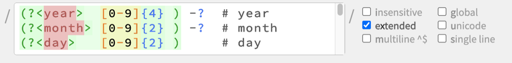

# Regex Editor/Highlighter

A web-based editor and syntax highlighter for regular expressions, built as a
custom element (`<regex-editor>`) using
[lit-element](https://github.com/Polymer/lit-element). The highlighter itself
runs in both Node and modern browsers. I use this in regular expression teaching, as well as projects where I want web-based editing of regexes in applications such as rules engines.



As an ES6 module and custom element (web component), it's portable anywhere:

```js
    import { regexHighlight, RegexError } from './src/regex-highlighter';

    const regexHL = regexHighlight({ regex: '/a|b++/gi' }); // simple JS object
    regexHL.flags; // STRING of any flags passed to regex engine, alphabetized
    regexHL.html; // HTML markup for regex just <span> tags with classes
    regexHL.array; // a specialized list of tokens for generating the HTML
```

More likely, you'll just use the custom element:

```html
    <regex-editor regexValue="a|b|\w+/" flags="ixm"></regex-editor>
```

## Install Dependencies

This editor uses the excellent regexp-tree for its underlying parsing, and lit-element as mentioned.

`% npm install`

## Run Tests

`% npm test`

## Build for Browser

Built bundles are not committed to the repo, so run these first. They create
`web/regex-editor-bundle.js` and `web/regex-editor-bundle.css`:

`% npm run build-js`
`% npm run build-css`

## Serve

`% npm run serve` // needs the `ws` CLI from [local-web-server](https://www.npmjs.com/package/local-web-server) (`npm install -g local-web-server`)

Then open the demo at the printed URL. `web/index.html` demonstrates the
`<regex-editor>` element and doubles as a visual test page.

## Developing

To rebuild automatically on changes, use [watchman](https://facebook.github.io/watchman/):

~~~~
% watchman watch-del-all
% watchman -- trigger src/ jsfiles '*.js' -- npm run build-js
% watchman -- trigger src/ webfiles '*.less' -- npm run build-css
% watchman shutdown-server # when done
~~~~

## File Structure

* `src/` - the source code, with `index.js` as the entry point for the browser build. Styles are in `src/index.less`.
* `tests/` - unit tests written with Ava.
* `web/` - the demo page (`index.html`) and build output.
